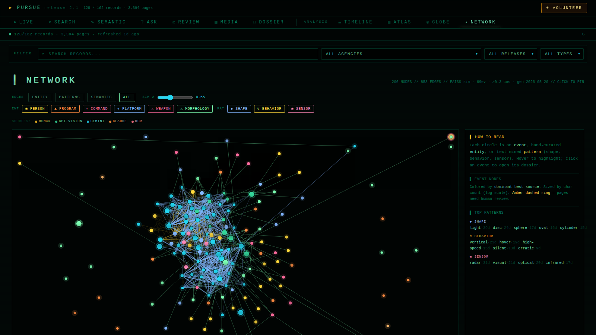

# PURSUE Console

Three AIs read every declassified war.gov UAP page; the console shows you where they disagree — and lets you be the tiebreaker.



[Live site](https://rizzleroc.github.io/pursue-console/) · [Browse cases](https://rizzleroc.github.io/pursue-console/) · [See AI disagreements](https://rizzleroc.github.io/pursue-console/)

## A senior intel official, on the record

Late 2025, SECRET//NOFORN. An FBI 302 from a senior US intelligence official aboard a search helicopter at a US military facility logs the moment an LP/OP-tracked orb *"gained elevation, came within ten feet of [the helicopter]"* — then split, then a swarm nobody could count. [Read it on the live console](https://rizzleroc.github.io/pursue-console/) (DOSSIER → USPER) · [source on war.gov](https://www.war.gov/medialink/ufo/release_1/usper-statement-redacted.pdf).

## What you can do here

- **Browse 162 declassified records** — open any case file with cross-linked entities and recurring patterns. → DOSSIER tab.
- **See where the AI transcriptions disagree** — every page is transcribed by up to four sources (Gemini, ChatGPT, Claude, OCR); disputes are queued worst-first. → REVIEW tab.
- **Fix one disputed page in 30 seconds** — read the source side-by-side with each AI's guess, type the correct version, submit. Becomes the gold standard that grades every machine source forever.

## Why this exists, relative to other projects

Other teams have built archives around the [war.gov/UFO](https://www.war.gov/UFO) PURSUE releases:

- [DenisSergeevitch/UFO-USA](https://github.com/DenisSergeevitch/UFO-USA) — upstream that scrapes war.gov directly and publishes the full corpus as markdown. **PURSUE Console consumes Denis's manifest as its source of truth** — without it, this repo has no data.
- [wretcher207/the-ufo-files](https://github.com/wretcher207/the-ufo-files) — hand-written, narrative per-case writeups.
- [pursue-uap-project/pursueproject](https://github.com/pursue-uap-project/pursueproject) — bilingual searchable web archive.
- [vfp2/pursue-ufo-files](https://github.com/vfp2/pursue-ufo-files) — downloader / indexer / analyzer.

PURSUE Console adds what none of them do: **a cross-source disagreement queue.** When the three AIs disagree about a page, a non-developer settles it, and the human-typed version becomes gold to grade every machine source after.

## Contribute

**Three paths, easiest to hardest. Pick the highest you can do.**

<details open>
<summary><b>30 seconds, no install</b> — settle a disputed page in the browser</summary>

Open the [REVIEW tab](https://rizzleroc.github.io/pursue-console/), pick a disputed page, click "Fix this page," type the corrected text in the modal, hit submit. A GitHub issue opens pre-filled with your correction; a bot converts it to a PR; a maintainer merges. You never touch a terminal.

</details>

<details>
<summary><b>5 minutes, GitHub account</b> — drop a .txt and open a PR</summary>

Drop a `.txt` file at `contributions/<your-handle>/human/<eid>/p<NNNN>.txt`, open a PR. File format and CI gates in [HOW-CAN-I-HELP.md](./HOW-CAN-I-HELP.md).

</details>

<details>
<summary><b>Power user, MCP fanout</b> — your own Chrome runs ChatGPT + Gemini + Claude vision OCR in parallel</summary>

One-command sparse install (~10 MB, not the full ~1 GB):

```bash
# macOS / Linux
curl -fsSL https://rizzleroc.github.io/pursue-console/install-helper.sh | bash

# Windows PowerShell
iwr https://rizzleroc.github.io/pursue-console/install-helper.ps1 | iex
```

Then:

```bash
cd pursue-helper
npm start --prefix pursue-vision-mcp                              # opens chatgpt + gemini + claude.ai tabs
npm run volunteer -- --my-handle=YOU --slice=20                   # ChatGPT
npm run volunteer -- --my-handle=YOU --slice=20 --provider=gemini # Gemini
npm run volunteer -- --my-handle=YOU --slice=20 --provider=claude # Claude
```

Full architecture in [HOW-CAN-I-HELP.md](./HOW-CAN-I-HELP.md).

</details>

## FAQ

<details>
<summary><b>Wait, what does "Release 2" mean? I see it in two places.</b></summary>

Two different things share the name and they're unrelated.

- **war.gov's releases** are the government's UAP document tranches under PURSUE (Presidential Unsealing and Reporting System for UAP Encounters). **Release 01** dropped May 8 2026 (162 records); **Release 02** dropped May 22 2026 (64 records — 6 PDFs + 51 videos + 7 audio). PDFs mirrored at `public/release_2/`; the video / audio ingestion is still pending (`npm run corpus:fetch-war-gov -- --release=02`).
- **This project's "Release 2.0"** is just the console's own **software version**. It doesn't track or correspond to war.gov's release numbering.

</details>

<details>
<summary><b>Is this affiliated with the Department of War or AARO?</b></summary>

No. PURSUE Console is an unofficial mirror with hand-curated structure on top. Every catalogued record cites back to `https://www.war.gov/medialink/ufo/release_1/...`. **All cases are marked UNRESOLVED by the originating agencies.**

</details>

<details>
<summary><b>How do I trust the transcriptions?</b></summary>

That's literally what the REVIEW queue and source-quality scoring are for. Every page sidecar records every source that transcribed it; agreement is scored pairwise (token Jaccard + length ratio); a human-typed page always wins canonical and is used as gold to grade every machine source over time. See the **Cross-source iteration loop** diagram below.

</details>

## More

<details>
<summary><b>Cross-source iteration loop</b> (architecture)</summary>

Every page sidecar (`data-raw/.vision-cache/<eid>/p<NNN>.sources.json`) tracks every source that has transcribed that page. The pipeline:

```
                ┌─────────────────────────────────────────────┐
                │   Multi-source page (≥2 transcripts)        │
                └────────────────┬────────────────────────────┘
                                 │ compare-sources.mjs
                                 ▼
              ┌───────────────────────────────────────────┐
              │   token Jaccard + length ratio agreement   │
              └────────┬───────────────────────────┬──────┘
              ≥0.85    │              <0.50        │
                       ▼                           ▼
                ┌─────────────┐         ┌───────────────────┐
                │  high conf. │         │  needs_review = 1  │
                │  canonical  │         │  → REVIEW queue    │
                │  promoted   │         └─────────┬─────────┘
                └─────────────┘                   │
                                     ┌────────────┴───────────┐
                                     │  reevaluate-disputed   │
                                     │  /fanout: same prompt  │
                                     │  through BOTH models   │
                                     └─────┬─────────────┬────┘
                                  v2 agree   v2 still
                                       │     diverge
                                       ▼           ▼
                              dispute_kind:  dispute_kind:
                             prompt-variance  page-intrinsic
                             (auto-settled)    (escalate to
                                                hand-typer)
```

A page is fully settled when:
- one human transcription exists (always wins canonical), OR
- two machine sources agree ≥0.85, OR
- standardized-prompt re-evaluation produces v2 agreement ≥0.85

When a human-typed page lands, it becomes the gold against which every machine source is scored — `data-raw/.source-quality.json` aggregates per-model mean accuracy over time.

</details>

<details>
<summary><b>Single source of truth: <code>data-raw/corpus.sqlite</code></b></summary>

Every dashboard number derives from one SQL query against a single SQLite file:

```
inventory     every record war.gov published (synced from upstream)
events        curated metadata (id, title, date, agency, coords, summary, tags)
pages         per-page: which sources transcribed it, chars, contributor,
              agreement_score, confidence, needs_review, dispute_kind
contributions provenance log (handle → eid/page → chars → imported_at)
runs          append-only build/scrape/import log
```

`scripts/db-rebuild.mjs` regenerates it from on-disk truth (sidecars, caches, contributions) on every build. The browser reads derived `public/*.json` artifacts — same data, view-side-friendly format.

</details>

<details>
<summary><b>Repo structure</b></summary>

```
pursue-console/
├── src/
│   ├── App.jsx                       view router · volunteer modal · hero gating
│   ├── data/events.js                catalogued records (121 of 162 Release 01 + 7 Release 02 = 128 total)
│   ├── data/entities.js              hand-curated entity graph
│   ├── components/
│   │   ├── Header.jsx                primary nav + analysis nav + VOLUNTEER button
│   │   ├── CorpusFreshness.jsx       single-line truth strip (DB-backed counts)
│   │   ├── SourceMix.jsx             reusable source-color encoding
│   │   └── VolunteerModal.jsx        priority ladder + setup snippets
│   └── views/
│       ├── LiveView, SearchView, SemanticSearchView, DossierView
│       ├── AskView                   natural-language Q&A (PATTERN + SMART RAG)
│       ├── ReviewView                cross-source disagreement queue
│       ├── MediaView                 visual library
│       ├── TimelineView, AtlasView, GlobeView, NetworkView
│       └── HelpView
│
├── scripts/                           the data pipeline (run by `npm run build`)
│   ├── sync-inventory.mjs            ← war.gov inventory via Denis manifest
│   ├── import-gemini-corpus.mjs      ← pulls Denis's Gemini transcripts
│   ├── import-contributions.mjs      ← merges volunteer PRs (incl. media)
│   ├── compare-sources.mjs           ← cross-source agreement → REVIEW queue
│   ├── reevaluate-disputed.mjs       ← /fanout standardized prompt re-run
│   ├── classify-visuals.mjs          ← per-page visual kind classifier
│   ├── build-text-files.mjs          ← collapses per-source → canonical .txt
│   ├── db-rebuild.mjs                ← regenerates data-raw/corpus.sqlite
│   ├── build-search-index.mjs        ← MiniSearch over public/text
│   ├── build-embeddings.py           ← sentence-transformers + FAISS
│   ├── build-live-feed.mjs           ← recent-pages stream
│   ├── build-work-available.mjs      ← public work queue (OCR · review · media)
│   ├── export-review-queue.mjs       ← REVIEW page bundles
│   ├── build-media-index.mjs         ← MEDIA library catalog
│   ├── build-corpus-version.mjs      ← freshness manifest
│   ├── volunteer.mjs                 ← OCR-transcription volunteer flow
│   ├── volunteer-media.mjs           ← image + context volunteer flow
│   ├── validate-contribution.mjs     ← PR gate (schema · safety · quality)
│   └── diagnose-{coverage,page-alignment}.mjs   ← maintainer diagnostics
│
├── pursue-vision-mcp/                MIT, shipped to volunteers
│   ├── chatgpt-driver.mjs            ChatGPT browser tab driver
│   ├── gemini-driver.mjs             Gemini browser tab driver (NEW in 2.0)
│   ├── claude-driver.mjs             Claude (claude.ai) browser tab driver
│   ├── daemon.mjs                    /chat-with-files (provider routing) + /fanout
│   ├── start.mjs                     opens all tabs · launches daemon + monitor
│   └── monitor.mjs                   helper dashboard on :9224
│
├── data-raw/                         the canonical source — gitignored binaries,
│   ├── corpus.sqlite                   COMMITTED text caches:
│   ├── .vision-cache/<eid>/            per-source p<NNN>.<source>.txt + sidecar
│   ├── .ocr-cache/<eid>/               tesseract fallback
│   ├── .visuals/<eid>/p<NNN>.json      classifier output (per-page kind)
│   └── inventory-sync.json             Denis-upstream PDF manifest
│
├── public/                           build artifacts read by the browser
│   ├── corpus-stats.json             DB-derived truth (single source for UI counts)
│   ├── search-index.json, embeddings.bin, live-feed.json,
│   ├── review-queue.json, review-text/<eid>/<page>.json
│   ├── media.json, media/<eid>/p<NNN>.jpg
│   └── work-available.json, corpus-version.json, etc.
│
├── contributions/<handle>/            volunteer submissions
│   ├── gpt-vision/<eid>/p<NNN>.txt    ChatGPT OCR via volunteer.mjs
│   ├── gemini/<eid>/p<NNN>.txt        Gemini OCR via volunteer.mjs
│   ├── claude/<eid>/p<NNN>.txt        Claude OCR via volunteer.mjs
│   ├── human/<eid>/p<NNN>.txt         hand-typed (always wins canonical)
│   └── media/<eid>/p<NNN>.{json,jpg}  image + verbatim context
│
└── .github/workflows/
    ├── deploy.yml                    Pages on every push to main
    ├── validate-contribution.yml     PR validator
    ├── faiss-rebuild.yml             every 4h if inputs changed
    └── backup.yml                    6h corpus snapshot to GitHub Release
```

</details>

<details>
<summary><b>Run locally</b></summary>

```bash
git clone https://github.com/rizzleroc/pursue-console
cd pursue-console
npm install
npm run dev          # http://localhost:5173
npm run build        # → dist/ (runs the full data pipeline first)
```

The full build chain runs every push to main (`deploy.yml`):

```
copy-ort-assets · sync-inventory · import-gemini-corpus · import-contributions ·
compare-sources · build-text-files · db-rebuild · export-review-queue ·
build-search-index · build-live-feed · build-event-similarity ·
build-dossier-extracts · build-patterns · build-work-available ·
build-media-index · build-corpus-version · vite build
```

</details>

<details>
<summary><b>Maintainer batches</b> (manual, not on every deploy)</summary>

```bash
npm run corpus:vision             # ChatGPT vision OCR via the daemon
npm run corpus:embed              # Python: rebuild FAISS embeddings
npm run corpus:classify           # per-page visual kind classification
npm run corpus:reeval             # re-run disputed pages through /fanout
npm run corpus:coverage           # per-event matrix (complete · gap · mismatch)
npm run corpus:alignment          # page-numbering sanity check across sources
npm run corpus:sync-check         # diff every count between local build + live github.io
```

Stack: Vite + React 19 + Tailwind v3 + better-sqlite3. No chart libraries; the network view is a hand-rolled force-directed layout, the globe is an orthographic projection, the heatmap is CSS grid. FAISS runs in browser via `@huggingface/transformers` + ORT WASM (~25 MB INT8 model, cached in IndexedDB after first download).

</details>

<details>
<summary><b>Backups + freshness</b></summary>

- **6-hour corpus snapshot** → GitHub Release with timestamped tag (`.github/workflows/backup.yml`)
- **FAISS re-index** every 4 h if inputs changed (`.github/workflows/faiss-rebuild.yml`, skip-on-unchanged hash)
- **CorpusFreshness strip** at the top of every non-LIVE view, polls every 60 s, shows last-build age

</details>

<details>
<summary><b>Source posture</b></summary>

Every catalogued record cites back to `https://www.war.gov/medialink/ufo/release_1/...`. PDF inventory reconciles against [DenisSergeevitch/UFO-USA](https://github.com/DenisSergeevitch/UFO-USA) (the upstream maintainer scraped war.gov directly via Gemini; war.gov blocks our IPs via Akamai). As of 2.2, `scripts/sync-inventory.mjs` and `scripts/import-gemini-corpus.mjs` apply URL normalization so that Denis's hyphenated manifest URLs are matched correctly against the raw-space war.gov URLs stored in `events.js`; this improved Denis manifest-to-event matching from 68/120 → 112/120 PDFs. The remaining 8 PDFs have genuine filename discrepancies that require manual reconciliation. **All cases marked UNRESOLVED by the originating agencies.** This console is an unofficial mirror with hand-curated structure on top; nothing here adds claims beyond the primary documents.

When new Release tranches drop, that's where new event records come from.

</details>

<details>
<summary><b>Corpus stats</b> (live from <code>public/corpus-stats.json</code>)</summary>

| | |
|---|---|
| **Records inventoried** | 162 Release 01 + 6 of 64 Release 02 files mirrored (all 6 Release 02 PDFs; 7 audio + 51 video pending). 128 events catalogued total (121 Release 01 + 7 Release 02) |
| **Pages transcribed** | 3,394 across 65 events |
| **First-pull backlog** | 52 catalogued docs · 754 pages awaiting download + transcription |
| **Per source** | 3,370 Gemini · 446 GPT-vision · 0 Claude · 693 OCR transcripts (4 pages OCR-only · 689 cross-checked against vision) · 55 contributor-submitted |
| **Multi-source pages** | 426 (cross-checked for agreement) |
| **Review queue** | 0 pages flagged — corpus is essentially fully vision-covered (22 reevaluated, 3 settled by standardized prompt) |

</details>

---

[](https://github.com/rizzleroc/pursue-console/actions/workflows/deploy.yml) [](https://github.com/rizzleroc/pursue-console/actions/workflows/faiss-rebuild.yml) [](./LICENSE) [](https://rizzleroc.github.io/pursue-console/) [](./CHANGELOG.md) [](./ROADMAP.md)

## License

[MIT](./LICENSE) © 2026 PURSUE Console contributors. The bundled `pursue-vision-mcp/` is also MIT and can be used by any project that needs a slim ChatGPT / Gemini / Claude browser-tab driver.
