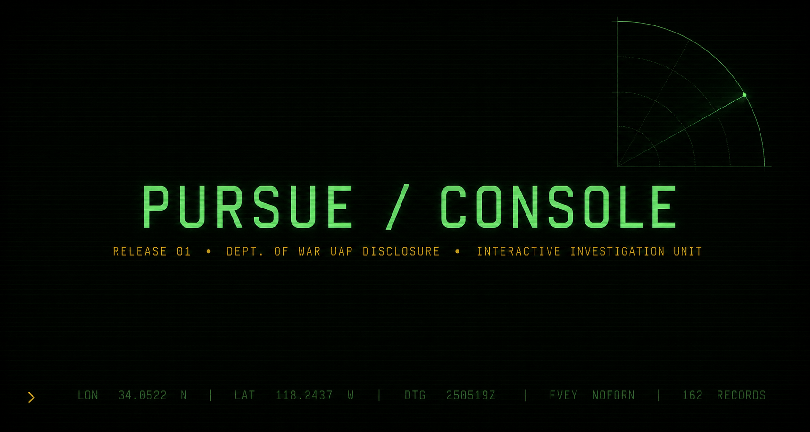

# PURSUE Console · Release 2.0



> **An open, community-built investigation desk for the [war.gov/UFO Release 01](https://www.war.gov/UFO) disclosure.**
> *Department of War, May 8 2026 — 173 records. All cases UNRESOLVED.*

[](https://github.com/rizzleroc/pursue-console/actions/workflows/deploy.yml)
[](https://github.com/rizzleroc/pursue-console/actions/workflows/faiss-rebuild.yml)
[](./LICENSE)
[](https://rizzleroc.github.io/pursue-console/)
[](./CHANGELOG.md)
[](./ROADMAP.md)

**Live:** https://rizzleroc.github.io/pursue-console/

---

## What this is

The war.gov inventory is a flat list of PDFs and videos. Reading them one by one tells you each case. Reading them as a system tells you what the corpus is *actually* saying. The console adds the connective tissue, surfaces the gaps, and lets anyone improve the data.

**Release 2.0 reframes the console as a blended-data investigation desk.** Every page is transcribed by 1–4 machine and human sources; the system tells you what they agree on, surfaces what they don't, and routes disputes to humans.

### Current corpus (live from `public/corpus-stats.json`)

| | |
|---|---|
| **Records inventoried** | 173 (121 catalogued · 52 awaiting metadata) |
| **Pages transcribed** | 3,394 across 65 events |
| **Per source** | 3,370 Gemini · 427 GPT-vision · 4 OCR · 18 contributor-submitted |
| **Multi-source pages** | 425 (cross-checked for agreement) |
| **Review queue** | 0 pages flagged — corpus is essentially fully vision-covered (22 reevaluated, 3 settled by standardized prompt) |

---

## Features (2.0)

### LIVE — what the corpus is doing right now
Pages streaming in from machine OCR + volunteer submissions. Per-event progress strip. Source-mix dot for every event (which engines have transcribed it).

### SEARCH + SEMANTIC
Hybrid lexical (MiniSearch) + dense semantic (sentence-transformers + FAISS). All embeddings run in the browser; nothing leaves the page. FAISS index auto-rebuilds every 4 hours when input data changes (skip-on-unchanged hash check, no commit pollution).

### REVIEW · cross-source disagreement queue
The site's most consequential surface. Pages where Gemini ↔ ChatGPT ↔ (future) human disagree appear here worst-first. Click any item to see every source's text side-by-side with pairwise agreement scores. A "FIX IT" button points at the volunteer flow. When a human resolves a page, it becomes canonical, and we learn how each machine source scored vs. that gold for that page.

### MEDIA library
Every page classified as containing visual content — photographs, hand-drawings, photocopied negatives, newspaper clippings, maps, diagrams. Grid view, filter by kind / agency / event. Click → modal with description + deep-link straight to that page in DOSSIER.

### DOSSIER per record
Cross-linked entities, threads, co-occurring records ranked by shared-entity overlap. Direct deep-link from REVIEW and MEDIA.

### ANALYSIS row · TIMELINE, ATLAS, GLOBE, NETWORK
- TIMELINE — chronology by decade
- ATLAS — agency × decade heatmap
- GLOBE — drag-rotate orthographic projection
- NETWORK — force-directed graph of events ↔ hand-curated entities ↔ text-mined patterns (shape/behavior/sensor). Event node color = dominant best transcription source. Size = log(chars). Amber dashed ring = pages need review.

---

## Cross-source iteration loop (2.0 architecture)

Every page sidecar (`data-raw/.vision-cache/<eid>/p<NNN>.sources.json`) tracks every source that has transcribed that page. The pipeline:

```
                ┌─────────────────────────────────────────────┐
                │   Multi-source page (≥2 transcripts)        │
                └────────────────┬────────────────────────────┘
                                 │ compare-sources.mjs
                                 ▼
              ┌───────────────────────────────────────────┐
              │   token Jaccard + length ratio agreement   │
              └────────┬───────────────────────────┬──────┘
              ≥0.85    │              <0.50        │
                       ▼                           ▼
                ┌─────────────┐         ┌───────────────────┐
                │  high conf. │         │  needs_review = 1  │
                │  canonical  │         │  → REVIEW queue    │
                │  promoted   │         └─────────┬─────────┘
                └─────────────┘                   │
                                     ┌────────────┴───────────┐
                                     │  reevaluate-disputed   │
                                     │  /fanout: same prompt  │
                                     │  through BOTH models   │
                                     └─────┬─────────────┬────┘
                                  v2 agree   v2 still
                                       │     diverge
                                       ▼           ▼
                              dispute_kind:  dispute_kind:
                             prompt-variance  page-intrinsic
                             (auto-settled)    (escalate to
                                                hand-typer)
```

A page is fully settled when:
- one human transcription exists (always wins canonical), OR
- two machine sources agree ≥0.85, OR
- standardized-prompt re-evaluation produces v2 agreement ≥0.85

When a human-typed page lands, it becomes the gold against which every machine source is scored — `data-raw/.source-quality.json` aggregates per-model mean accuracy over time.

---

## Single source of truth: `data-raw/corpus.sqlite`

Every dashboard number derives from one SQL query against a single SQLite file:

```
inventory     every record war.gov published (synced from upstream)
events        curated metadata (id, title, date, agency, coords, summary, tags)
pages         per-page: which sources transcribed it, chars, contributor,
              agreement_score, confidence, needs_review, dispute_kind
contributions provenance log (handle → eid/page → chars → imported_at)
runs          append-only build/scrape/import log
```

`scripts/db-rebuild.mjs` regenerates it from on-disk truth (sidecars, caches, contributions) on every build. The browser reads derived `public/*.json` artifacts — same data, view-side-friendly format.

---

## 📡 How can I help — priority ladder

**Three open priorities. Please pick the highest open one.**

### 1. Settle the review queue
Pages where machine sources disagree. Type the correct version from the source PDF. **One disputed page resolved = canonical text settled forever, used as gold to grade every machine source.** No tooling required — drop a `.txt` at `contributions/<handle>/human/<eid>/p<NNNN>.txt`, open a PR.

→ Open the **REVIEW** tab on the live console (count badge in the nav).

### 2. Transcribe new pages
Run the volunteer script. Your own logged-in browser does OCR via ChatGPT *or* Gemini. The MCP daemon now supports both providers in parallel (`POST /fanout`).

```bash
# Setup once (~10 MB sparse clone, not the full ~1 GB repo):
curl -fsSL https://rizzleroc.github.io/pursue-console/install-helper.sh | bash    # macOS / Linux
iwr https://rizzleroc.github.io/pursue-console/install-helper.ps1 | iex            # Windows

# Then:
cd pursue-helper
npm start --prefix pursue-vision-mcp                              # opens chatgpt + gemini tabs
npm run volunteer -- --my-handle=YOU --slice=20                   # ChatGPT
npm run volunteer -- --my-handle=YOU --slice=20 --provider=gemini # Gemini
```

### 3. Image + context capture
Pages classified as containing visuals (photographs, hand-drawings, newspaper clippings, maps, diagrams) need page screenshots + the **verbatim documentary context** from the surrounding pages (what introduces this image? what's the caption? what comes after?). For newspaper clippings, also the article body so it becomes its own searchable doc.

Two-phase volunteer flow (the script renders the pages so you can read them while typing context, no in-terminal pain):

```bash
node scripts/volunteer-media.mjs --my-handle=YOU --slice=5     # claim + render
# (fill in the markdown templates at ~/.pursue-helper/media-staging/)
node scripts/volunteer-media.mjs --my-handle=YOU --commit      # commit + PR
```

Full spec: [VISUAL-EXTRACTION-PROCESS.md](./VISUAL-EXTRACTION-PROCESS.md).

→ Full architecture + per-path docs: [HOW-CAN-I-HELP.md](./HOW-CAN-I-HELP.md)

---

## Repo structure

```
pursue-console/
├── src/
│   ├── App.jsx                       view router · volunteer modal · hero gating
│   ├── data/events.js                catalogued records (121 of 173)
│   ├── data/entities.js              hand-curated entity graph
│   ├── components/
│   │   ├── Header.jsx                primary nav + analysis nav + VOLUNTEER button
│   │   ├── CorpusFreshness.jsx       single-line truth strip (DB-backed counts)
│   │   ├── SourceMix.jsx             reusable source-color encoding
│   │   └── VolunteerModal.jsx        priority ladder + setup snippets
│   └── views/
│       ├── LiveView, SearchView, SemanticSearchView, DossierView
│       ├── ReviewView                cross-source disagreement queue
│       ├── MediaView                 visual library
│       ├── TimelineView, AtlasView, GlobeView, NetworkView
│       └── HelpView
│
├── scripts/                           the data pipeline (run by `npm run build`)
│   ├── sync-inventory.mjs            ← war.gov inventory via Denis manifest
│   ├── import-gemini-corpus.mjs      ← pulls Denis's Gemini transcripts
│   ├── import-contributions.mjs      ← merges volunteer PRs (incl. media)
│   ├── compare-sources.mjs           ← cross-source agreement → REVIEW queue
│   ├── reevaluate-disputed.mjs       ← /fanout standardized prompt re-run
│   ├── classify-visuals.mjs          ← per-page visual kind classifier
│   ├── build-text-files.mjs          ← collapses per-source → canonical .txt
│   ├── db-rebuild.mjs                ← regenerates data-raw/corpus.sqlite
│   ├── build-search-index.mjs        ← MiniSearch over public/text
│   ├── build-embeddings.py           ← sentence-transformers + FAISS
│   ├── build-live-feed.mjs           ← recent-pages stream
│   ├── build-work-available.mjs      ← public work queue (OCR · review · media)
│   ├── export-review-queue.mjs       ← REVIEW page bundles
│   ├── build-media-index.mjs         ← MEDIA library catalog
│   ├── build-corpus-version.mjs      ← freshness manifest
│   ├── volunteer.mjs                 ← OCR-transcription volunteer flow
│   ├── volunteer-media.mjs           ← image + context volunteer flow
│   ├── validate-contribution.mjs     ← PR gate (schema · safety · quality)
│   └── diagnose-{coverage,page-alignment}.mjs   ← maintainer diagnostics
│
├── pursue-vision-mcp/                MIT, shipped to volunteers
│   ├── chatgpt-driver.mjs            ChatGPT browser tab driver
│   ├── gemini-driver.mjs             Gemini browser tab driver (NEW in 2.0)
│   ├── daemon.mjs                    /chat-with-files (provider routing) + /fanout
│   ├── start.mjs                     opens both tabs · launches daemon + monitor
│   └── monitor.mjs                   helper dashboard on :9224
│
├── data-raw/                         the canonical source — gitignored binaries,
│   ├── corpus.sqlite                   COMMITTED text caches:
│   ├── .vision-cache/<eid>/            per-source p<NNN>.<source>.txt + sidecar
│   ├── .ocr-cache/<eid>/               tesseract fallback
│   ├── .visuals/<eid>/p<NNN>.json      classifier output (per-page kind)
│   └── inventory-sync.json             Denis-upstream PDF manifest
│
├── public/                           build artifacts read by the browser
│   ├── corpus-stats.json             DB-derived truth (single source for UI counts)
│   ├── search-index.json, embeddings.bin, live-feed.json,
│   ├── review-queue.json, review-text/<eid>/<page>.json
│   ├── media.json, media/<eid>/p<NNN>.jpg
│   └── work-available.json, corpus-version.json, etc.
│
├── contributions/<handle>/            volunteer submissions
│   ├── gpt-vision/<eid>/p<NNN>.txt    ChatGPT OCR via volunteer.mjs
│   ├── gemini/<eid>/p<NNN>.txt        Gemini OCR via volunteer.mjs
│   ├── human/<eid>/p<NNN>.txt         hand-typed (always wins canonical)
│   └── media/<eid>/p<NNN>.{json,jpg}  image + verbatim context
│
└── .github/workflows/
    ├── deploy.yml                    Pages on every push to main
    ├── validate-contribution.yml     PR validator
    ├── faiss-rebuild.yml             every 4h if inputs changed
    └── backup.yml                    6h corpus snapshot to GitHub Release
```

---

## Run locally

```bash
git clone https://github.com/rizzleroc/pursue-console
cd pursue-console
npm install
npm run dev          # http://localhost:5173
npm run build        # → dist/ (runs the full data pipeline first)
```

The full build chain runs every push to main (`deploy.yml`):

```
copy-ort-assets · sync-inventory · import-gemini-corpus · import-contributions ·
compare-sources · build-text-files · db-rebuild · export-review-queue ·
build-search-index · build-live-feed · build-event-similarity ·
build-dossier-extracts · build-patterns · build-work-available ·
build-media-index · build-corpus-version · vite build
```

### Maintainer batches (manual, not on every deploy)

```bash
npm run corpus:vision             # ChatGPT vision OCR via the daemon
npm run corpus:embed              # Python: rebuild FAISS embeddings
npm run corpus:classify           # per-page visual kind classification
npm run corpus:reeval             # re-run disputed pages through /fanout
npm run corpus:coverage           # per-event matrix (complete · gap · mismatch)
npm run corpus:alignment          # page-numbering sanity check across sources
npm run corpus:sync-check         # diff every count between local build + live github.io
```

Stack: Vite + React 19 + Tailwind v3 + better-sqlite3. No chart libraries; the network view is a hand-rolled force-directed layout, the globe is an orthographic projection, the heatmap is CSS grid. FAISS runs in browser via `@huggingface/transformers` + ORT WASM (~25 MB INT8 model, cached in IndexedDB after first download).

---

## Backups + freshness

- **6-hour corpus snapshot** → GitHub Release with timestamped tag (`.github/workflows/backup.yml`)
- **FAISS re-index** every 4 h if inputs changed (`.github/workflows/faiss-rebuild.yml`, skip-on-unchanged hash)
- **CorpusFreshness strip** at the top of every non-LIVE view, polls every 60 s, shows last-build age

---

## Source posture

Every catalogued record cites back to `https://www.war.gov/medialink/ufo/release_1/...`. PDF inventory reconciles against [DenisSergeevitch/UFO-USA](https://github.com/DenisSergeevitch/UFO-USA) (the upstream maintainer scraped war.gov directly via Gemini; war.gov blocks our IPs via Akamai). As of 2.2, `scripts/sync-inventory.mjs` and `scripts/import-gemini-corpus.mjs` apply URL normalization so that Denis's hyphenated manifest URLs are matched correctly against the raw-space war.gov URLs stored in `events.js`; this improved Denis manifest-to-event matching from 68/120 → 112/120 PDFs. The remaining 8 PDFs have genuine filename discrepancies that require manual reconciliation. **All cases marked UNRESOLVED by the originating agencies.** This console is an unofficial mirror with hand-curated structure on top; nothing here adds claims beyond the primary documents.

When new Release tranches drop, that's where new event records come from.

---

## License

[MIT](./LICENSE) © 2026 PURSUE Console contributors. The bundled `pursue-vision-mcp/` is also MIT and can be used by any project that needs a slim ChatGPT-or-Gemini browser-tab driver.
